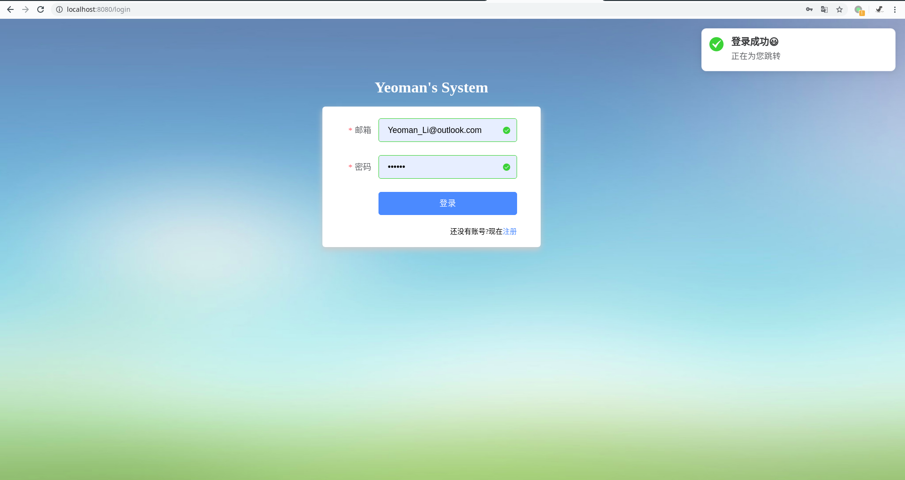
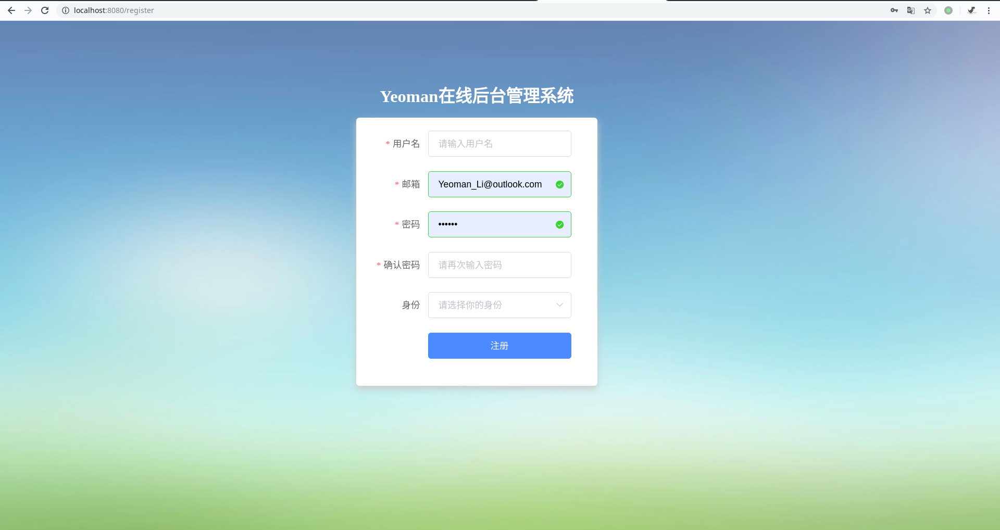
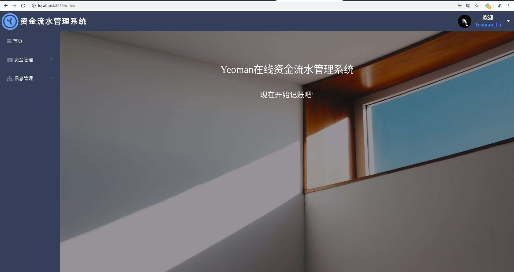
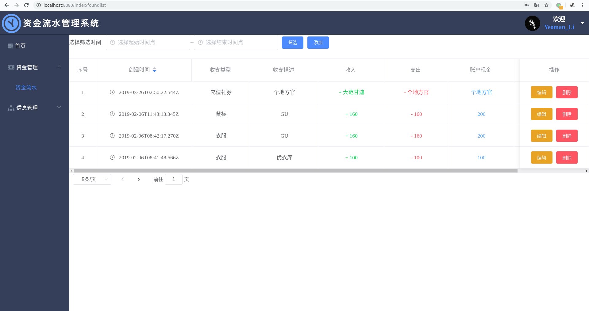
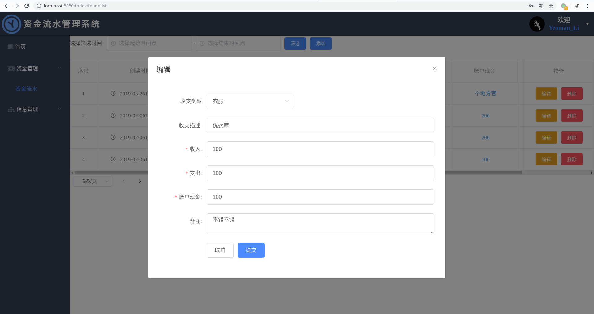

# Yeoman 资金流水管理系统

一个使用Vue.js、Express、MongoDB构建的资金流水系统

：node

：jwt-decode

：element-ui


## 构建和运行

1. 在这个页面上下载.zip源文件并解压，或者直接在终端执行 `git clone https://github.com/YeomanLi/Found-Managment.git`

   

2. 进入项目目录，并在你的终端中执行如下命令：

   ```bash
   # 安装后端接口的依赖
   npm install
   
   # 安装前端依赖
   cd client/
   npm install
   cd ..
   ```

   

3. 启动项目

   前后端联载：

   ```bash
   npm run dev
   ```

   

   当然你也可以单独启动任一服务

   ```bash
   # 启动后端服务
   npm run server
   
   # 启动前端
   npm run client
   ```

   

4. 进入 `http://localhost:8080/`来查看、调试项目


## 技术栈

1. [Express.js](http://expressjs.com/)：服务端框架
2. [Vue.js](https://cn.vuejs.org/index.html)：前端MVVM框架
3. 数据库使用的是[MongoDB](http://expressjs.com/)，[Mongoose](https://mongoosejs.com/)来管理操作数据库，[mLab](https://mlab.com/)来托管数据库
4. [Vue-CLI](https://cli.vuejs.org/zh/)来打包构建
5. [Element-UI](https://element.eleme.cn/#/en-US)：UI框架
6. [Axios](https://github.com/axios/axios)：发送接收请求


## To-do

- [x] 登录、注册
- [x] 请求、响应拦截
- [x] 路由守卫
- [x] Token过期处理
- [x] 权限控制
- [x] 组件封装
- [x] 页面刷新Vuex状态保持


## 截图预览












## 要点简述

1. 身份验证：使用jwt验证，登录成功后保存在localStorage中，每次发送请求头部带上这个token
2. 前端跨域直接在webpack上配置，自行参考
3. Vuex刷新保持状态，路由刷新前保存在localStorage中，Vuex缺省值设置为localStorage即可